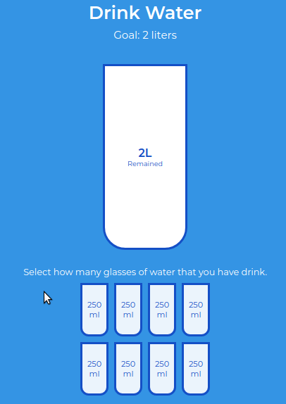

# drinkwater-project
   *Projeto para prática em CSS e JavaScript em cima de um projeto em canal no youtube. Onde foram aplicados pequenas refatorações de código, além de ESLint.*
   
### O Projeto:

   *O Projeto consiste em uma aplicação de gestão de consumo de água diária. A cada 250mls até 2 litros.*

   

### Habilidades:

- HTML5
- CSS3
- JavaScript
   - Manipulação do DOM
   - Eventos
- Código mantido no ESLint Airbnb.

### Referência:

  <h4>Canal Digital Ads and Marketing</h4>
  <a href="https://www.youtube.com/watch?v=O5H6Wy6TG3Y" target="_blank">Drink Water Pratice Project</a>

